# Solar MED 
test2 results

---

## State evolution

---

<grid drag="100 40" drop="top" bg="white">
**State evolution**

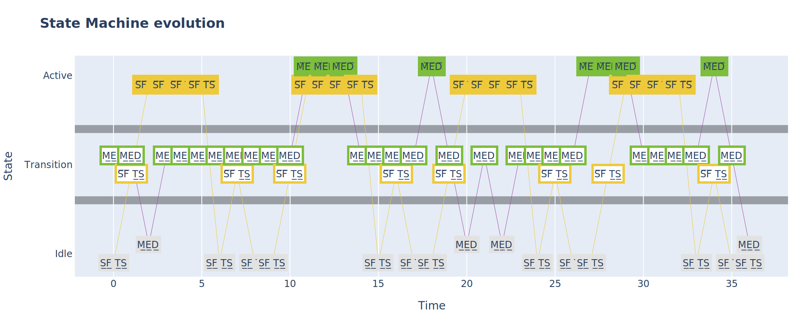
</grid>

<grid drag="100 40" drop="bottom" bg="blue">
Decision variables

</grid>

---

## Iterations

---

<grid drag="100 5" drop="top" bg="whitesmoke"  >
**ITERATION 0: SF idle-TS idle-MED generating vacuum**
<!-- element style="font-size: 24px"-->
</grid>

<grid drag="70 30" drop="0 10"  bg="whitesmoke"  >

</grid>

<grid drag="30 30" drop="70 10"  bg="whitesmoke"  >

</grid>

<grid drop="center" drag="100 30" bg="whitesmoke" >

</grid>

<grid drop="bottom" drag="100 30" bg="whitesmoke" >

</grid>

---

<grid drag="100 5" drop="top" bg="whitesmoke"  >
**ITERATION 1: SF active-TS idle-MED generating vacuum**
<!-- element style="font-size: 24px"-->
</grid>

<grid drag="70 30" drop="0 10"  bg="whitesmoke"  >

</grid>

<grid drag="30 30" drop="70 10"  bg="whitesmoke"  >
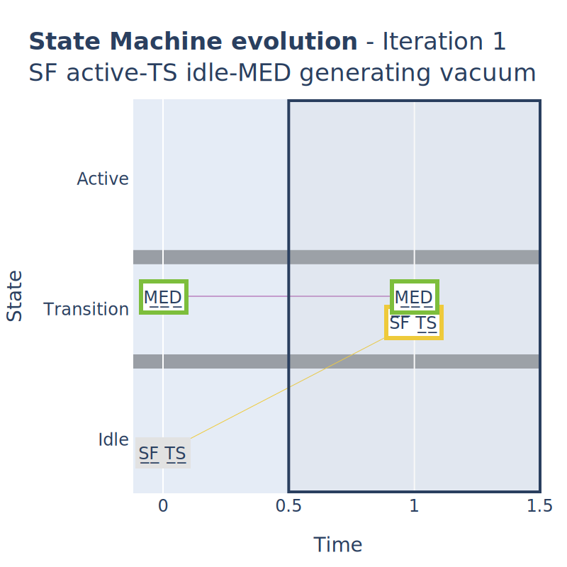
</grid>

<grid drop="center" drag="100 30" bg="whitesmoke" >

</grid>

<grid drop="bottom" drag="100 30" bg="whitesmoke" >

</grid>

---

<grid drag="100 5" drop="top" bg="whitesmoke"  >
**ITERATION 2: SF active-TS active-MED off**
<!-- element style="font-size: 24px"-->
</grid>

<grid drag="70 30" drop="0 10"  bg="whitesmoke"  >

</grid>

<grid drag="30 30" drop="70 10"  bg="whitesmoke"  >
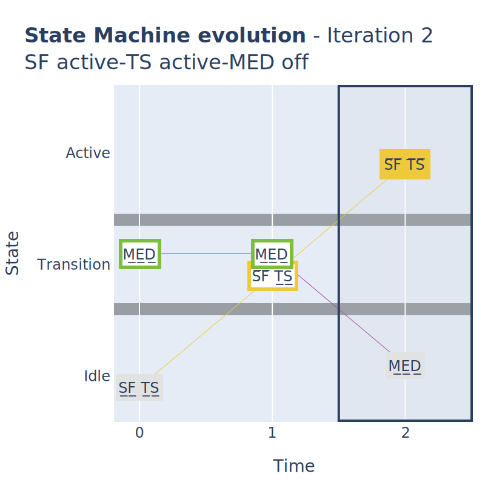
</grid>

<grid drop="center" drag="100 30" bg="whitesmoke" >

</grid>

<grid drop="bottom" drag="100 30" bg="whitesmoke" >
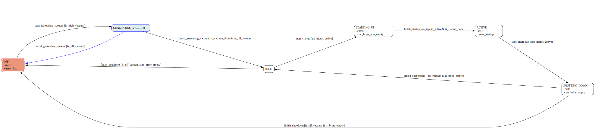
</grid>

---

<grid drag="100 5" drop="top" bg="whitesmoke"  >
**ITERATION 3: SF active-TS active-MED generating vacuum**
<!-- element style="font-size: 24px"-->
</grid>

<grid drag="70 30" drop="0 10"  bg="whitesmoke"  >

</grid>

<grid drag="30 30" drop="70 10"  bg="whitesmoke"  >

</grid>

<grid drop="center" drag="100 30" bg="whitesmoke" >

</grid>

<grid drop="bottom" drag="100 30" bg="whitesmoke" >
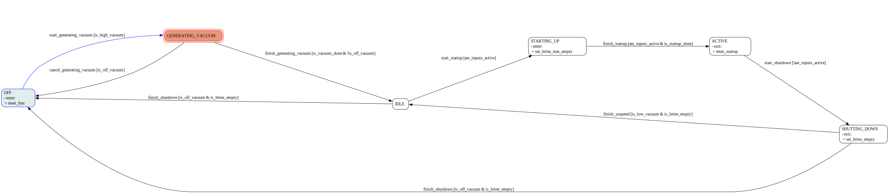
</grid>

---

<grid drag="100 5" drop="top" bg="whitesmoke"  >
**ITERATION 4: SF active-TS active-MED generating vacuum**
<!-- element style="font-size: 24px"-->
</grid>

<grid drag="70 30" drop="0 10"  bg="whitesmoke"  >

</grid>

<grid drag="30 30" drop="70 10"  bg="whitesmoke"  >

</grid>

<grid drop="center" drag="100 30" bg="whitesmoke" >

</grid>

<grid drop="bottom" drag="100 30" bg="whitesmoke" >

</grid>

---

<grid drag="100 5" drop="top" bg="whitesmoke"  >
**ITERATION 5: SF active-TS active-MED generating vacuum**
<!-- element style="font-size: 24px"-->
</grid>

<grid drag="70 30" drop="0 10"  bg="whitesmoke"  >

</grid>

<grid drag="30 30" drop="70 10"  bg="whitesmoke"  >
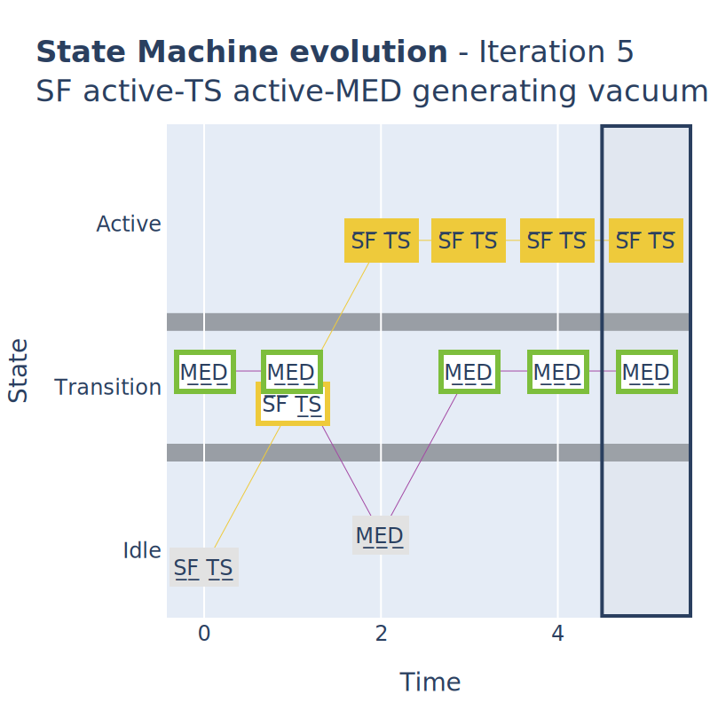
</grid>

<grid drop="center" drag="100 30" bg="whitesmoke" >

</grid>

<grid drop="bottom" drag="100 30" bg="whitesmoke" >

</grid>

---

<grid drag="100 5" drop="top" bg="whitesmoke"  >
**ITERATION 6: SF idle-TS idle-MED generating vacuum**
<!-- element style="font-size: 24px"-->
</grid>

<grid drag="70 30" drop="0 10"  bg="whitesmoke"  >

</grid>

<grid drag="30 30" drop="70 10"  bg="whitesmoke"  >

</grid>

<grid drop="center" drag="100 30" bg="whitesmoke" >
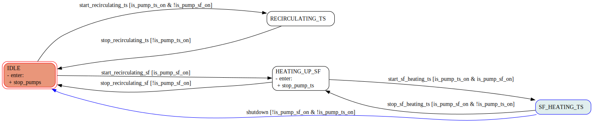
</grid>

<grid drop="bottom" drag="100 30" bg="whitesmoke" >

</grid>

---

<grid drag="100 5" drop="top" bg="whitesmoke"  >
**ITERATION 7: SF active-TS idle-MED generating vacuum**
<!-- element style="font-size: 24px"-->
</grid>

<grid drag="70 30" drop="0 10"  bg="whitesmoke"  >

</grid>

<grid drag="30 30" drop="70 10"  bg="whitesmoke"  >
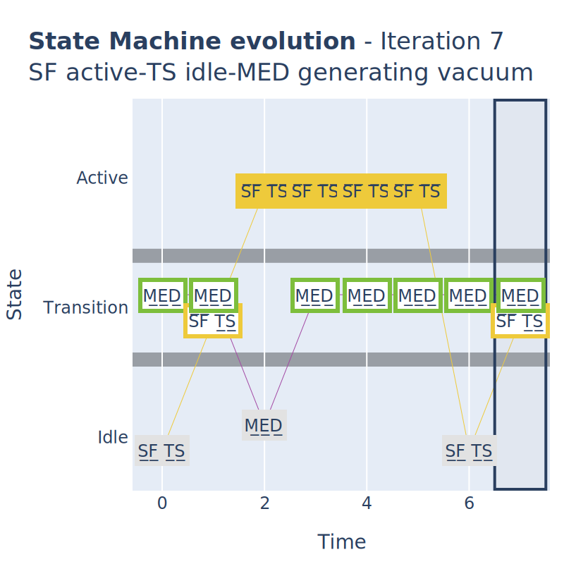
</grid>

<grid drop="center" drag="100 30" bg="whitesmoke" >

</grid>

<grid drop="bottom" drag="100 30" bg="whitesmoke" >

</grid>

---

<grid drag="100 5" drop="top" bg="whitesmoke"  >
**ITERATION 8: SF idle-TS idle-MED idle**
<!-- element style="font-size: 24px"-->
</grid>

<grid drag="70 30" drop="0 10"  bg="whitesmoke"  >

</grid>

<grid drag="30 30" drop="70 10"  bg="whitesmoke"  >
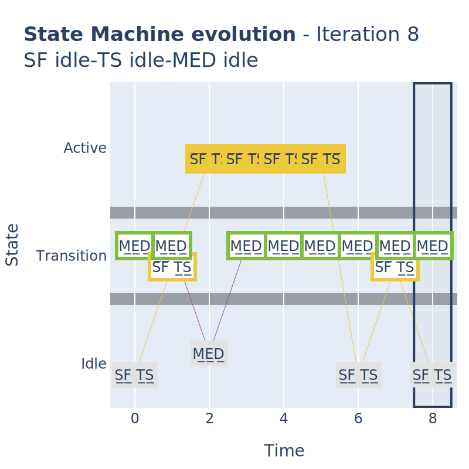
</grid>

<grid drop="center" drag="100 30" bg="whitesmoke" >

</grid>

<grid drop="bottom" drag="100 30" bg="whitesmoke" >

</grid>

---

<grid drag="100 5" drop="top" bg="whitesmoke"  >
**ITERATION 9: SF idle-TS idle-MED starting up**
<!-- element style="font-size: 24px"-->
</grid>

<grid drag="70 30" drop="0 10"  bg="whitesmoke"  >

</grid>

<grid drag="30 30" drop="70 10"  bg="whitesmoke"  >
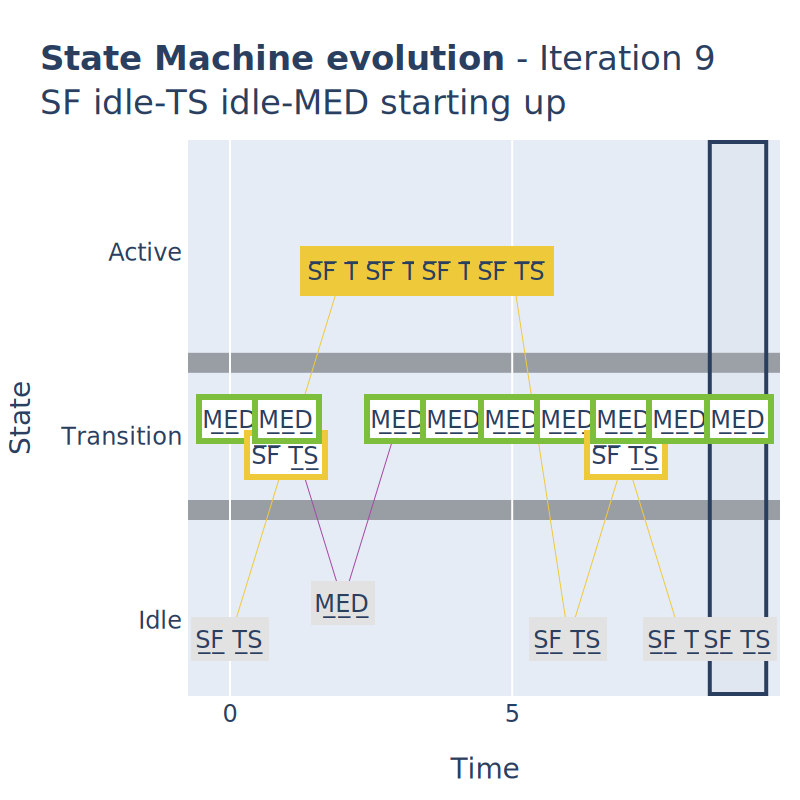
</grid>

<grid drop="center" drag="100 30" bg="whitesmoke" >

</grid>

<grid drop="bottom" drag="100 30" bg="whitesmoke" >

</grid>

---

<grid drag="100 5" drop="top" bg="whitesmoke"  >
**ITERATION 10: SF active-TS idle-MED starting up**
<!-- element style="font-size: 24px"-->
</grid>

<grid drag="70 30" drop="0 10"  bg="whitesmoke"  >

</grid>

<grid drag="30 30" drop="70 10"  bg="whitesmoke"  >

</grid>

<grid drop="center" drag="100 30" bg="whitesmoke" >

</grid>

<grid drop="bottom" drag="100 30" bg="whitesmoke" >

</grid>

---

<grid drag="100 5" drop="top" bg="whitesmoke"  >
**ITERATION 11: SF active-TS active-MED active**
<!-- element style="font-size: 24px"-->
</grid>

<grid drag="70 30" drop="0 10"  bg="whitesmoke"  >

</grid>

<grid drag="30 30" drop="70 10"  bg="whitesmoke"  >

</grid>

<grid drop="center" drag="100 30" bg="whitesmoke" >

</grid>

<grid drop="bottom" drag="100 30" bg="whitesmoke" >
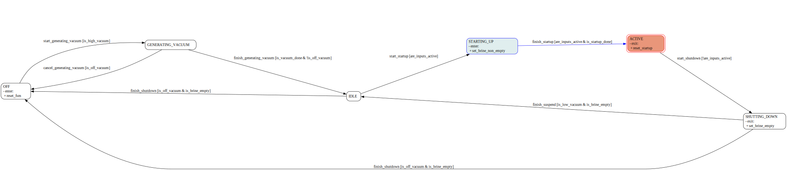
</grid>

---

<grid drag="100 5" drop="top" bg="whitesmoke"  >
**ITERATION 12: SF active-TS active-MED active**
<!-- element style="font-size: 24px"-->
</grid>

<grid drag="70 30" drop="0 10"  bg="whitesmoke"  >

</grid>

<grid drag="30 30" drop="70 10"  bg="whitesmoke"  >
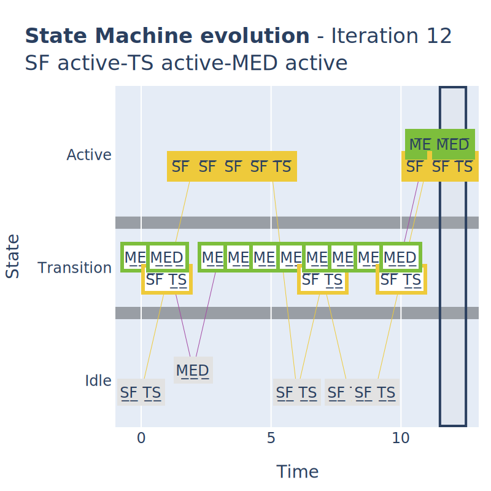
</grid>

<grid drop="center" drag="100 30" bg="whitesmoke" >

</grid>

<grid drop="bottom" drag="100 30" bg="whitesmoke" >

</grid>

---

<grid drag="100 5" drop="top" bg="whitesmoke"  >
**ITERATION 13: SF active-TS active-MED active**
<!-- element style="font-size: 24px"-->
</grid>

<grid drag="70 30" drop="0 10"  bg="whitesmoke"  >

</grid>

<grid drag="30 30" drop="70 10"  bg="whitesmoke"  >
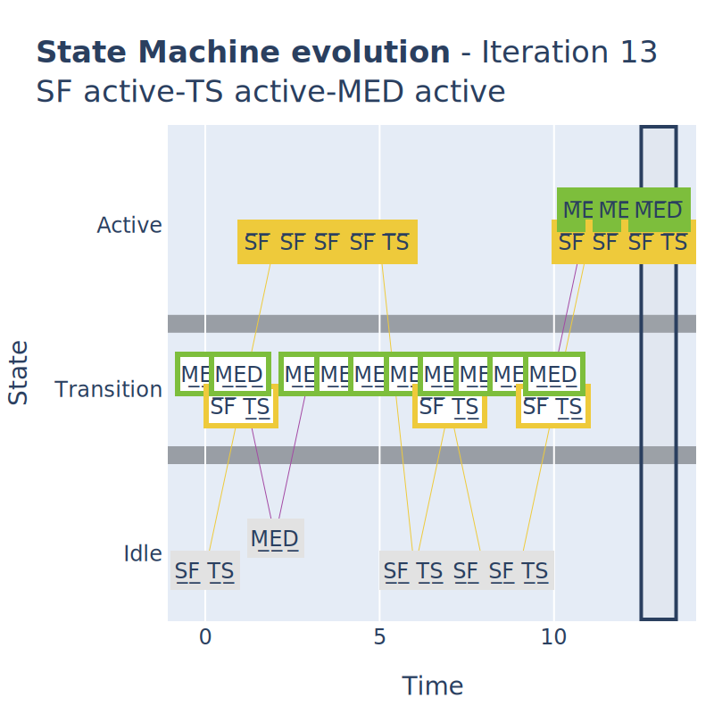
</grid>

<grid drop="center" drag="100 30" bg="whitesmoke" >

</grid>

<grid drop="bottom" drag="100 30" bg="whitesmoke" >

</grid>

---

<grid drag="100 5" drop="top" bg="whitesmoke"  >
**ITERATION 14: SF active-TS active-MED shutting down**
<!-- element style="font-size: 24px"-->
</grid>

<grid drag="70 30" drop="0 10"  bg="whitesmoke"  >

</grid>

<grid drag="30 30" drop="70 10"  bg="whitesmoke"  >
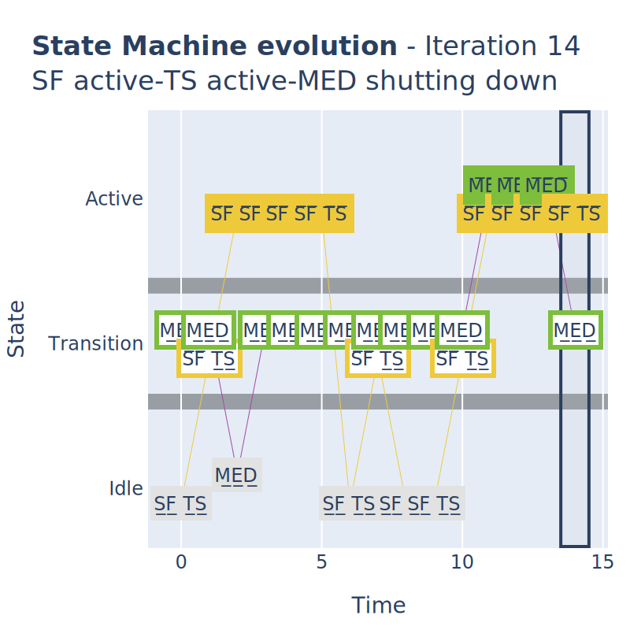
</grid>

<grid drop="center" drag="100 30" bg="whitesmoke" >

</grid>

<grid drop="bottom" drag="100 30" bg="whitesmoke" >

</grid>

---

<grid drag="100 5" drop="top" bg="whitesmoke"  >
**ITERATION 15: SF idle-TS idle-MED idle**
<!-- element style="font-size: 24px"-->
</grid>

<grid drag="70 30" drop="0 10"  bg="whitesmoke"  >

</grid>

<grid drag="30 30" drop="70 10"  bg="whitesmoke"  >

</grid>

<grid drop="center" drag="100 30" bg="whitesmoke" >

</grid>

<grid drop="bottom" drag="100 30" bg="whitesmoke" >
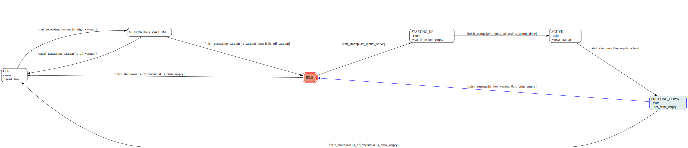
</grid>

---

<grid drag="100 5" drop="top" bg="whitesmoke"  >
**ITERATION 16: SF active-TS idle-MED starting up**
<!-- element style="font-size: 24px"-->
</grid>

<grid drag="70 30" drop="0 10"  bg="whitesmoke"  >

</grid>

<grid drag="30 30" drop="70 10"  bg="whitesmoke"  >

</grid>

<grid drop="center" drag="100 30" bg="whitesmoke" >

</grid>

<grid drop="bottom" drag="100 30" bg="whitesmoke" >

</grid>

---

<grid drag="100 5" drop="top" bg="whitesmoke"  >
**ITERATION 17: SF idle-TS idle-MED starting up**
<!-- element style="font-size: 24px"-->
</grid>

<grid drag="70 30" drop="0 10"  bg="whitesmoke"  >

</grid>

<grid drag="30 30" drop="70 10"  bg="whitesmoke"  >

</grid>

<grid drop="center" drag="100 30" bg="whitesmoke" >

</grid>

<grid drop="bottom" drag="100 30" bg="whitesmoke" >
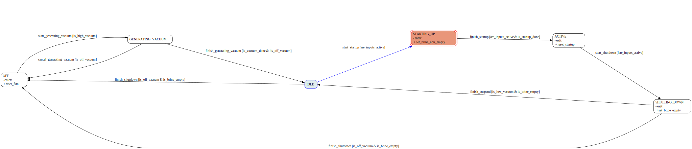
</grid>

---

<grid drag="100 5" drop="top" bg="whitesmoke"  >
**ITERATION 18: SF idle-TS idle-MED active**
<!-- element style="font-size: 24px"-->
</grid>

<grid drag="70 30" drop="0 10"  bg="whitesmoke"  >

</grid>

<grid drag="30 30" drop="70 10"  bg="whitesmoke"  >

</grid>

<grid drop="center" drag="100 30" bg="whitesmoke" >

</grid>

<grid drop="bottom" drag="100 30" bg="whitesmoke" >

</grid>

---

<grid drag="100 5" drop="top" bg="whitesmoke"  >
**ITERATION 19: SF active-TS idle-MED shutting down**
<!-- element style="font-size: 24px"-->
</grid>

<grid drag="70 30" drop="0 10"  bg="whitesmoke"  >

</grid>

<grid drag="30 30" drop="70 10"  bg="whitesmoke"  >

</grid>

<grid drop="center" drag="100 30" bg="whitesmoke" >

</grid>

<grid drop="bottom" drag="100 30" bg="whitesmoke" >

</grid>

---

<grid drag="100 5" drop="top" bg="whitesmoke"  >
**ITERATION 20: SF active-TS active-MED off**
<!-- element style="font-size: 24px"-->
</grid>

<grid drag="70 30" drop="0 10"  bg="whitesmoke"  >

</grid>

<grid drag="30 30" drop="70 10"  bg="whitesmoke"  >
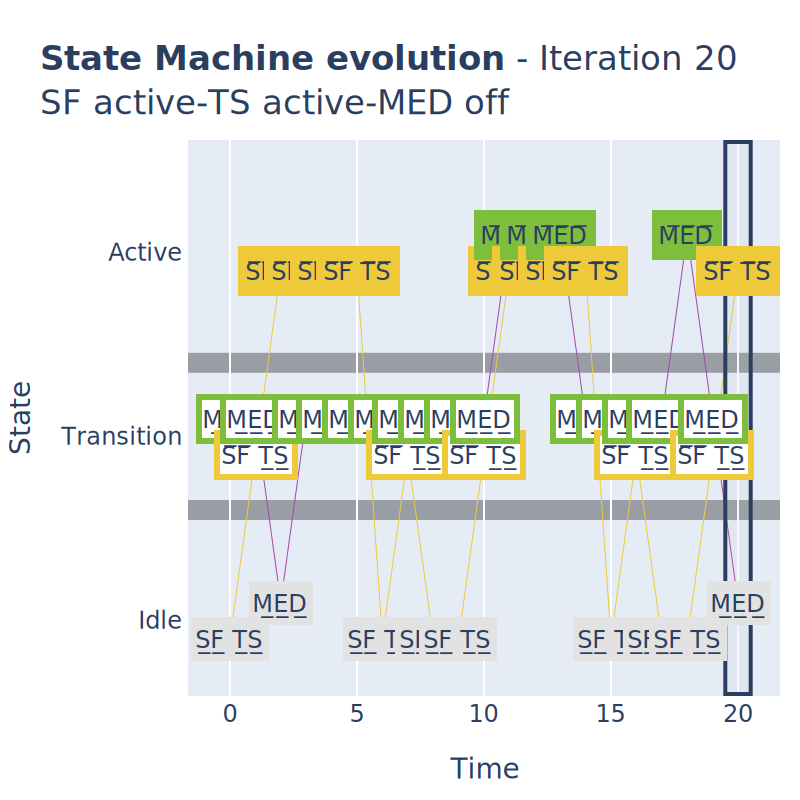
</grid>

<grid drop="center" drag="100 30" bg="whitesmoke" >

</grid>

<grid drop="bottom" drag="100 30" bg="whitesmoke" >

</grid>

---

<grid drag="100 5" drop="top" bg="whitesmoke"  >
**ITERATION 21: SF active-TS active-MED generating vacuum**
<!-- element style="font-size: 24px"-->
</grid>

<grid drag="70 30" drop="0 10"  bg="whitesmoke"  >

</grid>

<grid drag="30 30" drop="70 10"  bg="whitesmoke"  >

</grid>

<grid drop="center" drag="100 30" bg="whitesmoke" >

</grid>

<grid drop="bottom" drag="100 30" bg="whitesmoke" >

</grid>

---

<grid drag="100 5" drop="top" bg="whitesmoke"  >
**ITERATION 22: SF active-TS active-MED off**
<!-- element style="font-size: 24px"-->
</grid>

<grid drag="70 30" drop="0 10"  bg="whitesmoke"  >

</grid>

<grid drag="30 30" drop="70 10"  bg="whitesmoke"  >

</grid>

<grid drop="center" drag="100 30" bg="whitesmoke" >

</grid>

<grid drop="bottom" drag="100 30" bg="whitesmoke" >

</grid>

---

<grid drag="100 5" drop="top" bg="whitesmoke"  >
**ITERATION 23: SF active-TS active-MED generating vacuum**
<!-- element style="font-size: 24px"-->
</grid>

<grid drag="70 30" drop="0 10"  bg="whitesmoke"  >

</grid>

<grid drag="30 30" drop="70 10"  bg="whitesmoke"  >
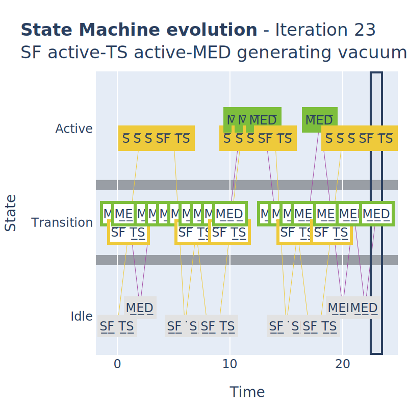
</grid>

<grid drop="center" drag="100 30" bg="whitesmoke" >

</grid>

<grid drop="bottom" drag="100 30" bg="whitesmoke" >

</grid>

---

<grid drag="100 5" drop="top" bg="whitesmoke"  >
**ITERATION 24: SF idle-TS idle-MED idle**
<!-- element style="font-size: 24px"-->
</grid>

<grid drag="70 30" drop="0 10"  bg="whitesmoke"  >

</grid>

<grid drag="30 30" drop="70 10"  bg="whitesmoke"  >
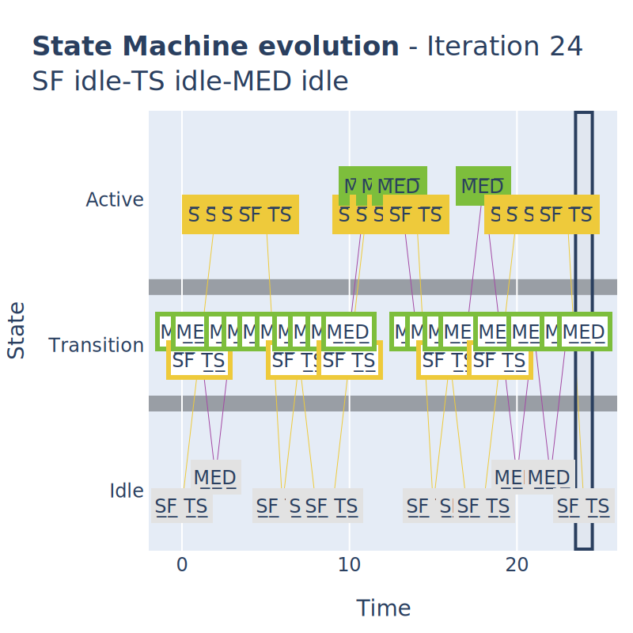
</grid>

<grid drop="center" drag="100 30" bg="whitesmoke" >

</grid>

<grid drop="bottom" drag="100 30" bg="whitesmoke" >

</grid>

---

<grid drag="100 5" drop="top" bg="whitesmoke"  >
**ITERATION 25: SF active-TS idle-MED starting up**
<!-- element style="font-size: 24px"-->
</grid>

<grid drag="70 30" drop="0 10"  bg="whitesmoke"  >

</grid>

<grid drag="30 30" drop="70 10"  bg="whitesmoke"  >
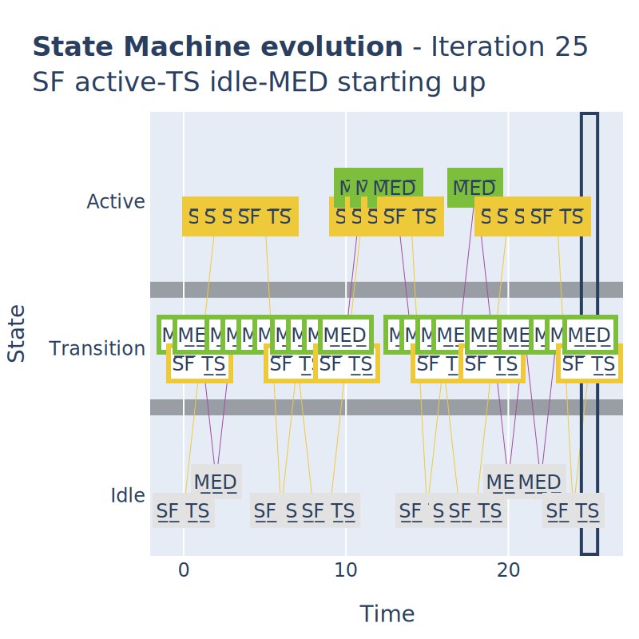
</grid>

<grid drop="center" drag="100 30" bg="whitesmoke" >

</grid>

<grid drop="bottom" drag="100 30" bg="whitesmoke" >

</grid>

---

<grid drag="100 5" drop="top" bg="whitesmoke"  >
**ITERATION 26: SF idle-TS idle-MED starting up**
<!-- element style="font-size: 24px"-->
</grid>

<grid drag="70 30" drop="0 10"  bg="whitesmoke"  >

</grid>

<grid drag="30 30" drop="70 10"  bg="whitesmoke"  >
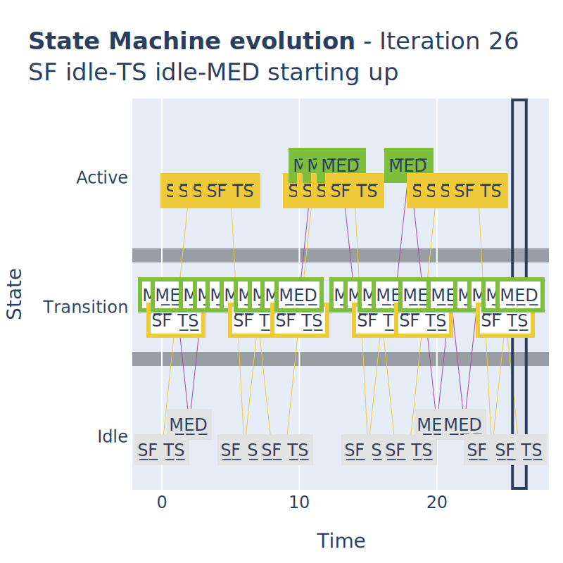
</grid>

<grid drop="center" drag="100 30" bg="whitesmoke" >

</grid>

<grid drop="bottom" drag="100 30" bg="whitesmoke" >

</grid>

---

<grid drag="100 5" drop="top" bg="whitesmoke"  >
**ITERATION 27: SF idle-TS idle-MED active**
<!-- element style="font-size: 24px"-->
</grid>

<grid drag="70 30" drop="0 10"  bg="whitesmoke"  >

</grid>

<grid drag="30 30" drop="70 10"  bg="whitesmoke"  >

</grid>

<grid drop="center" drag="100 30" bg="whitesmoke" >

</grid>

<grid drop="bottom" drag="100 30" bg="whitesmoke" >

</grid>

---

<grid drag="100 5" drop="top" bg="whitesmoke"  >
**ITERATION 28: SF active-TS idle-MED active**
<!-- element style="font-size: 24px"-->
</grid>

<grid drag="70 30" drop="0 10"  bg="whitesmoke"  >

</grid>

<grid drag="30 30" drop="70 10"  bg="whitesmoke"  >
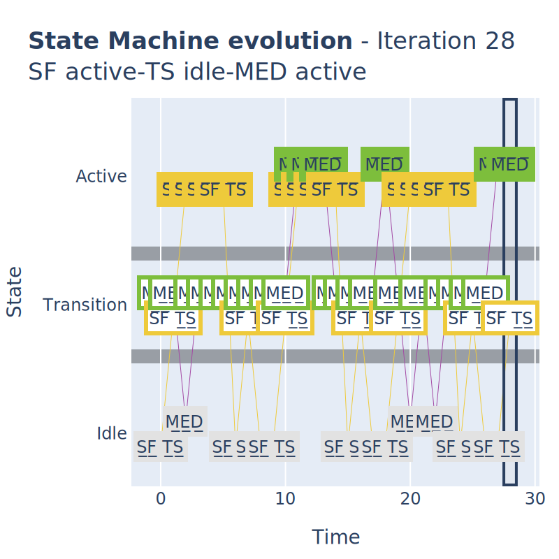
</grid>

<grid drop="center" drag="100 30" bg="whitesmoke" >

</grid>

<grid drop="bottom" drag="100 30" bg="whitesmoke" >

</grid>

---

<grid drag="100 5" drop="top" bg="whitesmoke"  >
**ITERATION 29: SF active-TS active-MED active**
<!-- element style="font-size: 24px"-->
</grid>

<grid drag="70 30" drop="0 10"  bg="whitesmoke"  >

</grid>

<grid drag="30 30" drop="70 10"  bg="whitesmoke"  >
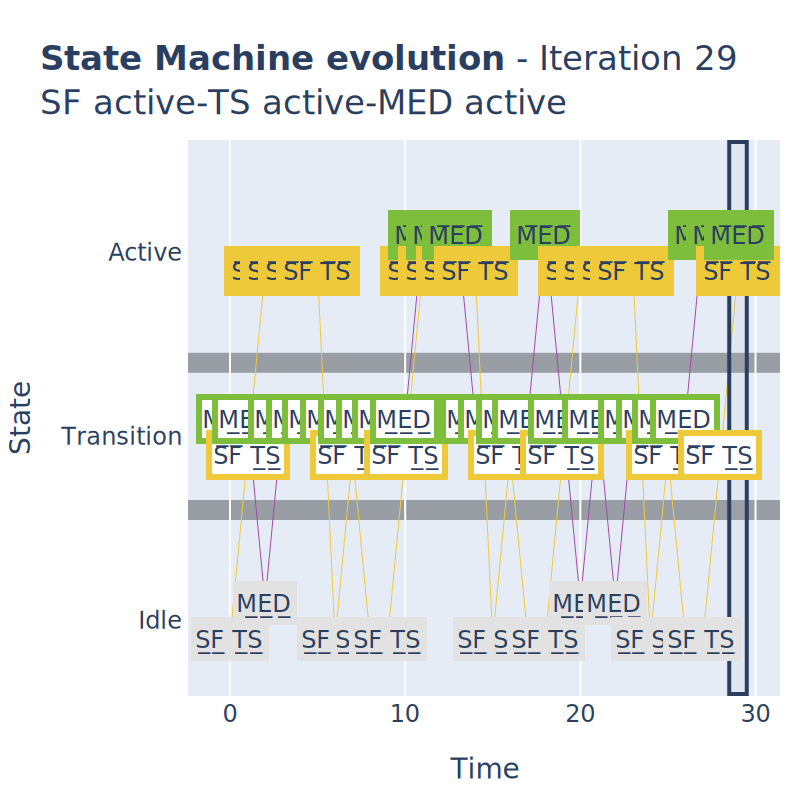
</grid>

<grid drop="center" drag="100 30" bg="whitesmoke" >

</grid>

<grid drop="bottom" drag="100 30" bg="whitesmoke" >

</grid>

---

<grid drag="100 5" drop="top" bg="whitesmoke"  >
**ITERATION 30: SF active-TS active-MED shutting down**
<!-- element style="font-size: 24px"-->
</grid>

<grid drag="70 30" drop="0 10"  bg="whitesmoke"  >

</grid>

<grid drag="30 30" drop="70 10"  bg="whitesmoke"  >

</grid>

<grid drop="center" drag="100 30" bg="whitesmoke" >

</grid>

<grid drop="bottom" drag="100 30" bg="whitesmoke" >

</grid>

---

<grid drag="100 5" drop="top" bg="whitesmoke"  >
**ITERATION 31: SF active-TS active-MED idle**
<!-- element style="font-size: 24px"-->
</grid>

<grid drag="70 30" drop="0 10"  bg="whitesmoke"  >

</grid>

<grid drag="30 30" drop="70 10"  bg="whitesmoke"  >
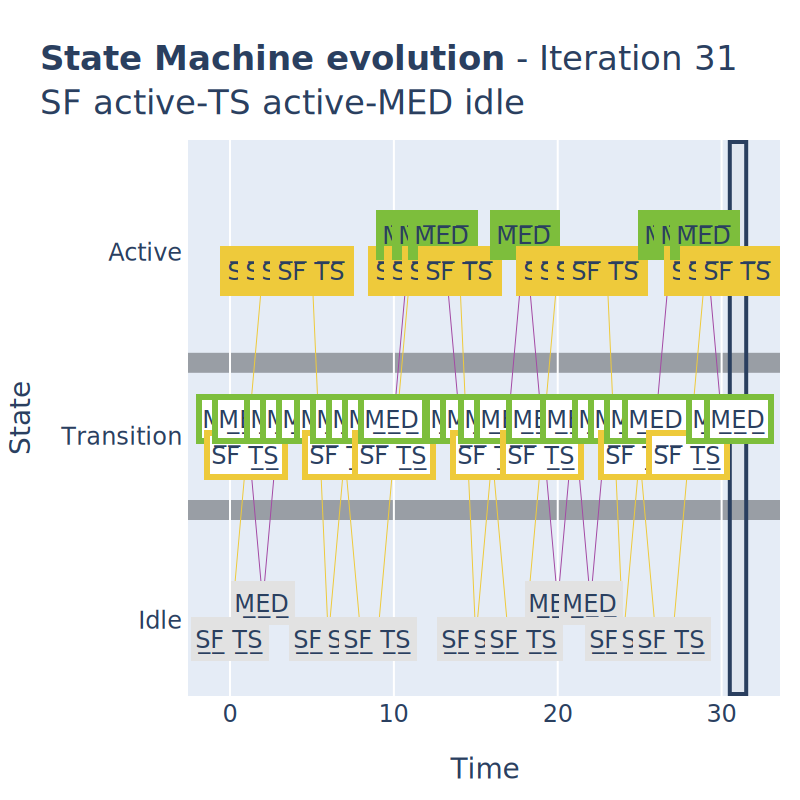
</grid>

<grid drop="center" drag="100 30" bg="whitesmoke" >

</grid>

<grid drop="bottom" drag="100 30" bg="whitesmoke" >

</grid>

---

<grid drag="100 5" drop="top" bg="whitesmoke"  >
**ITERATION 32: SF active-TS active-MED starting up**
<!-- element style="font-size: 24px"-->
</grid>

<grid drag="70 30" drop="0 10"  bg="whitesmoke"  >

</grid>

<grid drag="30 30" drop="70 10"  bg="whitesmoke"  >

</grid>

<grid drop="center" drag="100 30" bg="whitesmoke" >

</grid>

<grid drop="bottom" drag="100 30" bg="whitesmoke" >

</grid>

---

<grid drag="100 5" drop="top" bg="whitesmoke"  >
**ITERATION 33: SF idle-TS idle-MED starting up**
<!-- element style="font-size: 24px"-->
</grid>

<grid drag="70 30" drop="0 10"  bg="whitesmoke"  >

</grid>

<grid drag="30 30" drop="70 10"  bg="whitesmoke"  >

</grid>

<grid drop="center" drag="100 30" bg="whitesmoke" >

</grid>

<grid drop="bottom" drag="100 30" bg="whitesmoke" >

</grid>

---

<grid drag="100 5" drop="top" bg="whitesmoke"  >
**ITERATION 34: SF active-TS idle-MED active**
<!-- element style="font-size: 24px"-->
</grid>

<grid drag="70 30" drop="0 10"  bg="whitesmoke"  >

</grid>

<grid drag="30 30" drop="70 10"  bg="whitesmoke"  >
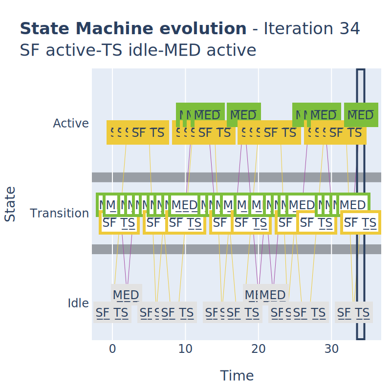
</grid>

<grid drop="center" drag="100 30" bg="whitesmoke" >

</grid>

<grid drop="bottom" drag="100 30" bg="whitesmoke" >

</grid>

---

<grid drag="100 5" drop="top" bg="whitesmoke"  >
**ITERATION 35: SF idle-TS idle-MED shutting down**
<!-- element style="font-size: 24px"-->
</grid>

<grid drag="70 30" drop="0 10"  bg="whitesmoke"  >

</grid>

<grid drag="30 30" drop="70 10"  bg="whitesmoke"  >

</grid>

<grid drop="center" drag="100 30" bg="whitesmoke" >

</grid>

<grid drop="bottom" drag="100 30" bg="whitesmoke" >

</grid>

---

<grid drag="100 5" drop="top" bg="whitesmoke"  >
**ITERATION 36: SF idle-TS idle-MED off**
<!-- element style="font-size: 24px"-->
</grid>

<grid drag="70 30" drop="0 10"  bg="whitesmoke"  >

</grid>

<grid drag="30 30" drop="70 10"  bg="whitesmoke"  >

</grid>

<grid drop="center" drag="100 30" bg="whitesmoke" >

</grid>

<grid drop="bottom" drag="100 30" bg="whitesmoke" >
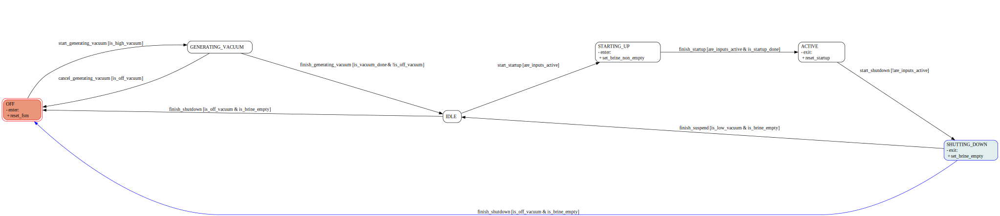
</grid>

---

